# WarehouseOps

WarehouseOps is a fullstack logistics and warehouse operations system built as a professional portfolio project.

The system represents a fictional B2B technology import company that imports laptops, monitors, networking equipment, storage devices and accessories, then sells them to retailers such as Elgiganten, Power, Inet and Dustin.

The goal of the project is to demonstrate practical skills in .NET, React, SQL Server, authentication, role based authorization, testing, Docker, GitHub Actions and security aware development.

## Tech stack

### Backend

* ASP.NET Core Web API
* C#
* Entity Framework Core
* SQL Server
* JWT authentication
* Role based authorization
* Swagger
* xUnit
* Moq
* FluentAssertions

### Frontend

* React
* TypeScript
* Vite
* React Router
* Axios
* TanStack React Query
* React Hook Form
* Zod
* Tailwind CSS
* Lucide React
* Recharts

### DevOps

* Docker
* Docker Compose
* GitHub Actions

## Main features

* Login and logout
* JWT based authentication
* Role based access control
* Product management
* Inventory management
* Customer management
* Order management
* Shipment management
* Incident management
* Dashboard with operational overview
* Audit log for important changes
* Frontend role based actions
* Backend authorization for protected endpoints
* Global exception handling
* Backend service tests
* GitHub Actions CI
* Docker Compose setup with SQL Server, backend and frontend
* Demo seed data for a B2B technology warehouse scenario

## Screenshots

### Login

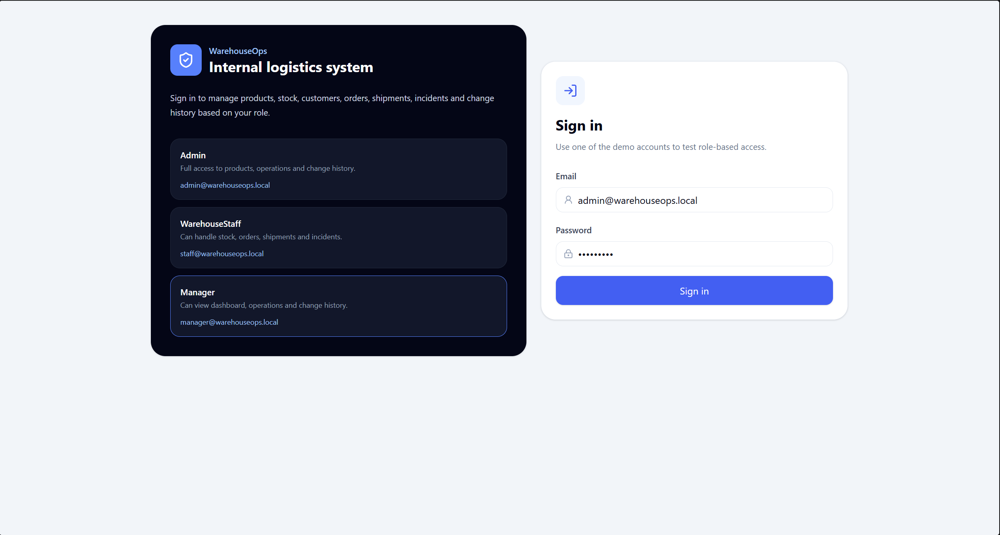

### Dashboard

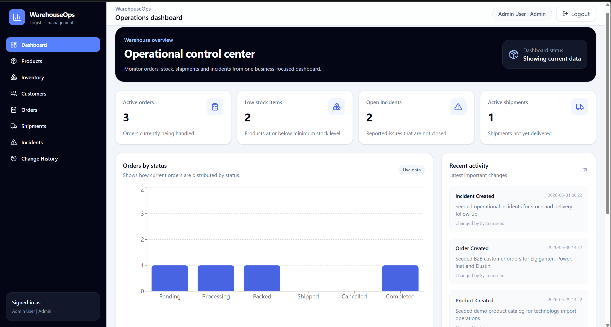

### Products

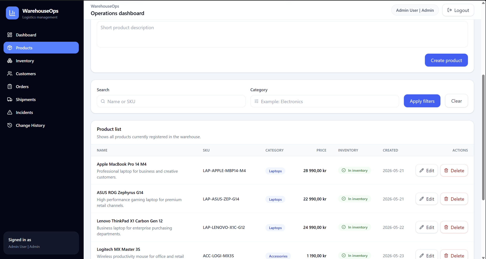

### Inventory

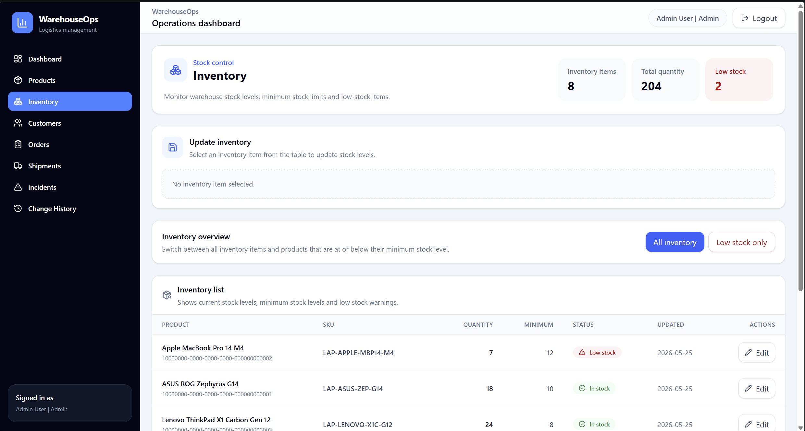

### Customers

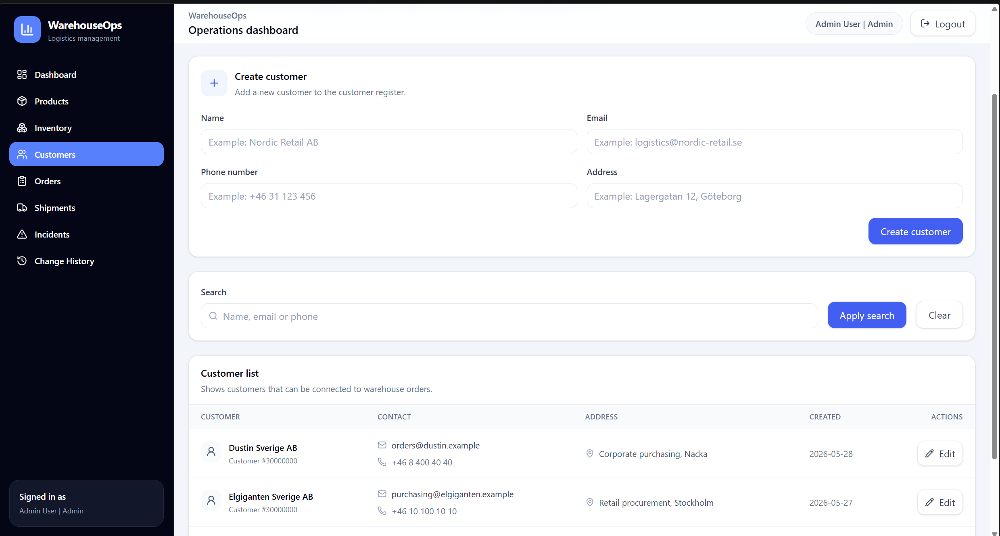

### Orders

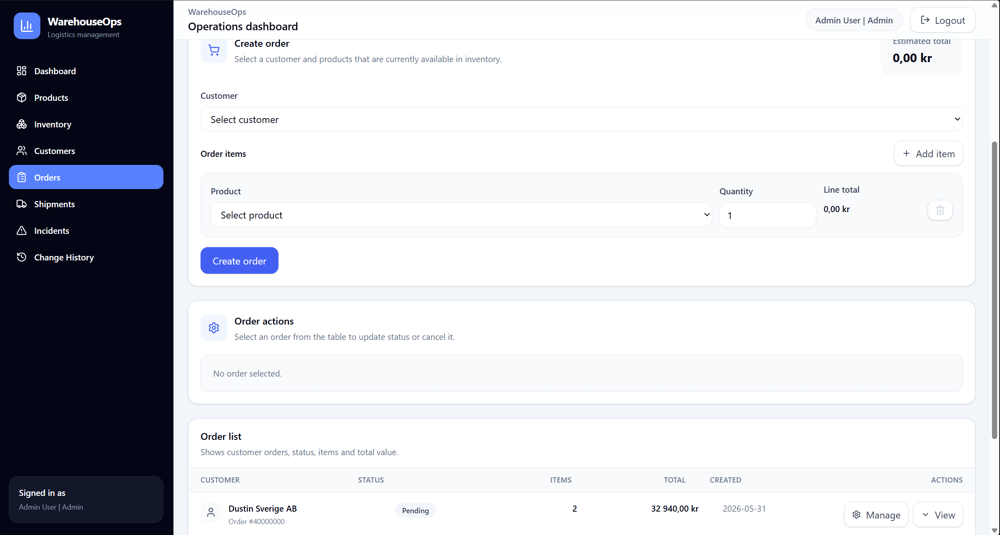

### Shipments

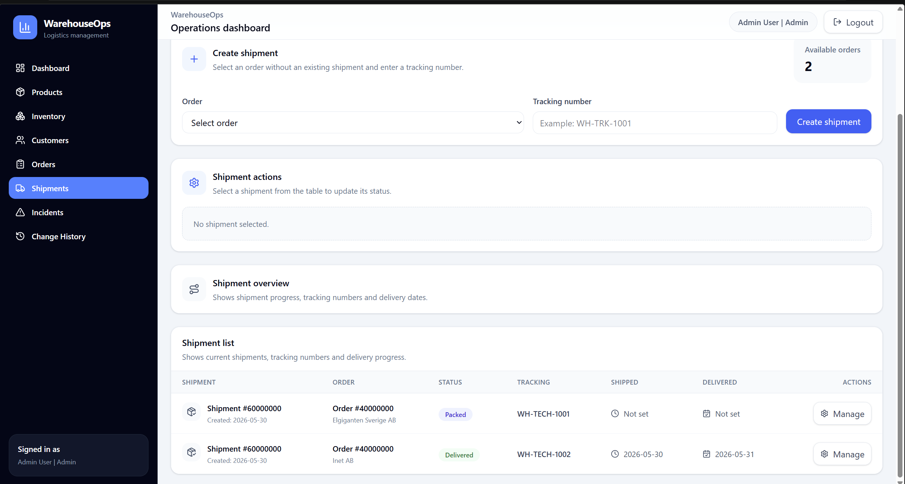

### Incidents

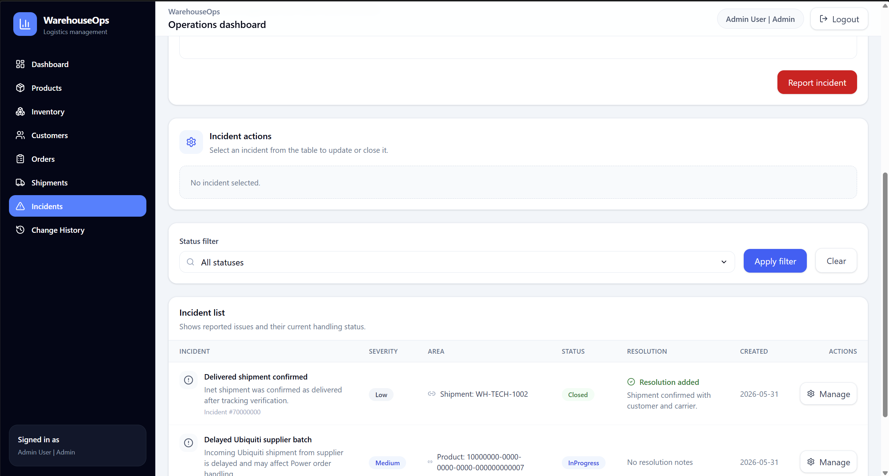

### Change History

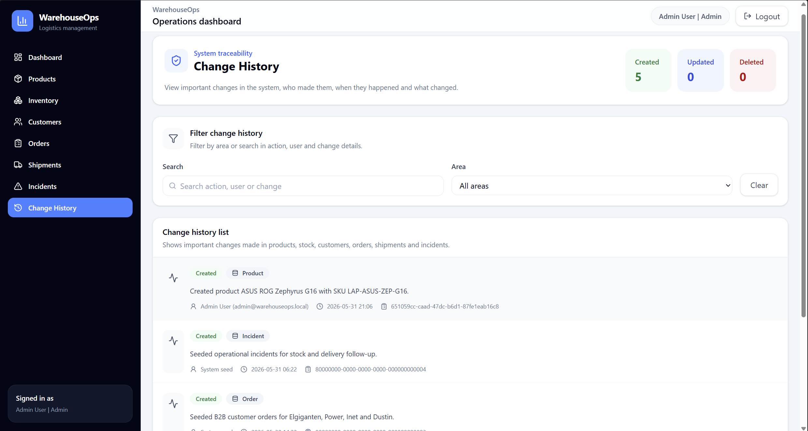

### GitHub Actions CI

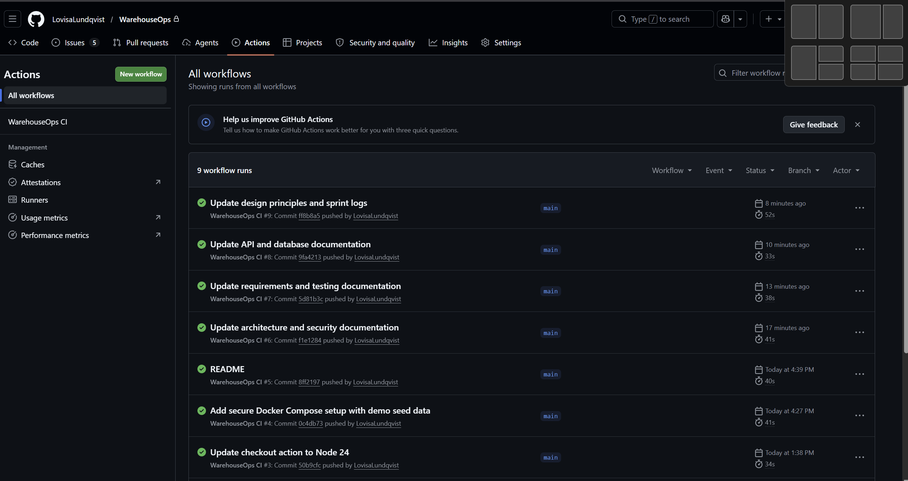

### Docker Compose

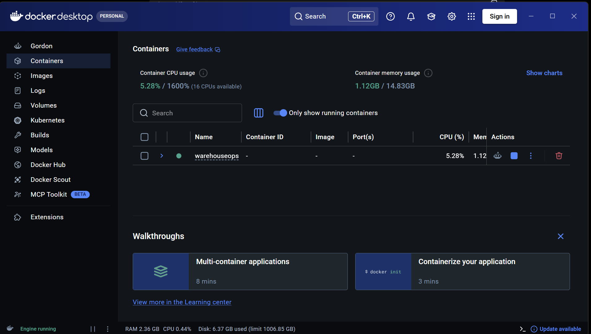

## Business scenario

WarehouseOps is designed around a fictional technology import company.

The company imports products such as:

* ASUS ROG Zephyrus laptops
* Apple MacBook Pro laptops
* Lenovo ThinkPad laptops
* Samsung monitors
* Sony headphones
* Logitech accessories
* Ubiquiti networking hardware
* Synology storage devices

The company sells these products to B2B customers such as:

* Elgiganten Sverige AB
* Power Sverige AB
* Inet AB
* Dustin Sverige AB

The system supports warehouse operations such as product handling, stock control, B2B order processing, shipment tracking, incident follow up and change history.

## User roles

WarehouseOps has three roles.

### Admin

Admin users have full administrative access.

Admin can:

* Create, update and delete products
* Add products to inventory
* Update inventory
* Create and update customers
* Create, update and cancel orders
* Create shipments
* Update shipment status
* Report incidents
* Update and close incidents
* View audit logs
* View dashboard

### WarehouseStaff

WarehouseStaff users handle daily warehouse operations.

WarehouseStaff can:

* View products
* Add products to inventory
* Update inventory
* Create and update customers
* Create, update and cancel orders
* Create shipments
* Update shipment status
* Report incidents
* Update and close incidents
* View dashboard

WarehouseStaff cannot:

* Create, update or delete products
* View audit logs

### Manager

Manager users have read only access to operational data and audit history.

Manager can:

* View dashboard
* View products
* View inventory
* View customers
* View orders
* View shipments
* View incidents
* View audit logs

Manager cannot:

* Create, update or delete products
* Update inventory
* Create or update customers
* Create, update or cancel orders
* Create or update shipments
* Report, update or close incidents

## Demo login

These accounts are only used for local development and portfolio demonstration.

| Role | Email | Password |
|---|---|---|
| Admin | admin@warehouseops.local | Admin123! |
| WarehouseStaff | staff@warehouseops.local | Staff123! |
| Manager | manager@warehouseops.local | Manager123! |

## Security features

WarehouseOps includes several security focused implementation choices.

* JWT authentication
* Role based authorization in backend controllers
* Protected frontend routes
* Role based UI actions
* Passwords are stored as PBKDF2 hashes, not plain text
* JWT secret is loaded through user secrets locally or environment variables in Docker
* Secrets are not stored in `appsettings.json`
* Database access uses Entity Framework Core
* No raw SQL is used with user input
* Global exception handling prevents internal server errors from being exposed to users
* Audit logs record important business changes
* Audit logs use the current authenticated user when changes are made
* Docker Compose binds frontend and backend ports to `127.0.0.1`
* SQL Server is only exposed inside the Docker network
* Demo seed data uses fictional business data and example email domains

## Architecture

The backend follows a layered architecture.

```text
WarehouseOps.Api
WarehouseOps.Application
WarehouseOps.Domain
WarehouseOps.Infrastructure
WarehouseOps.Tests
```

### WarehouseOps.Api

The API layer contains:

* Controllers
* Authentication setup
* Authorization setup
* Middleware
* Swagger configuration
* Current user service

Controllers handle HTTP requests and responses. They do not contain business logic.

### WarehouseOps.Application

The application layer contains:

* DTOs
* Service interfaces
* Business services
* Business validation
* Use case rules

Services contain the main business logic.

### WarehouseOps.Domain

The domain layer contains:

* Entities
* Enums
* Shared base entity

This layer represents the core business model.

### WarehouseOps.Infrastructure

The infrastructure layer contains:

* Entity Framework Core DbContext
* Repositories
* SQL Server persistence
* JWT token implementation
* Database migrations
* Demo seed data

### WarehouseOps.Tests

The test project contains backend service tests.

The current tests cover:

* ProductService
* InventoryService
* OrderService
* ShipmentService
* IncidentService

## Project structure

```text
WarehouseOps/
  backend/
    WarehouseOps.Api/
    WarehouseOps.Application/
    WarehouseOps.Domain/
    WarehouseOps.Infrastructure/
    WarehouseOps.Tests/
  frontend/
    warehouseops-client/
  docs/
  .github/
    workflows/
      ci.yml
  docker-compose.yml
  README.md
```

## Backend API areas

The backend includes APIs for:

* Authentication
* Dashboard
* Products
* Inventory
* Customers
* Orders
* Shipments
* Incidents
* Audit logs

Swagger is available locally at:

```text
http://localhost:5059/swagger
```

## Frontend

The frontend is a React TypeScript application.

It includes pages for:

* Login
* Dashboard
* Products
* Inventory
* Customers
* Orders
* Shipments
* Incidents
* Change History

The frontend uses React Query for server state, Axios for API calls, Zod and React Hook Form for validation, Tailwind CSS for styling and Recharts for dashboard charts.

## Running with Docker Compose

Docker Desktop must be installed and running.

Create a local `.env` file from the example file:

```powershell
Copy-Item .\.env.example .\.env
```

Start the full system:

```powershell
docker compose up -d
```

Open the frontend:

```text
http://localhost:3000
```

Open Swagger:

```text
http://localhost:5059/swagger
```

Stop the system:

```powershell
docker compose down
```

Stop the system and remove the Docker database volume:

```powershell
docker compose down -v
```

Use `docker compose down -v` only when you want to reset the Docker database.

## Docker setup

Docker Compose starts three services:

| Service | Description | Access |
|---|---|---|
| sqlserver | SQL Server database | Internal Docker network only |
| backend | ASP.NET Core Web API | http://localhost:5059 |
| frontend | React app served by Nginx | http://localhost:3000 |

The SQL Server container is not exposed to the host machine. Backend and frontend are bound to `127.0.0.1`.

## Demo seed data

The Docker setup includes demo seed data.

Seed data is enabled through:

```text
Database__SeedDemoData=true
```

The seed data is only inserted when the database has no products.

The seeded data includes:

* Products
* Inventory items
* Customers
* Orders
* Order items
* Shipments
* Incidents
* Audit logs

This makes the Docker version useful immediately after startup.

## Running locally without Docker

### Backend

Set the JWT secret using user secrets:

```powershell
cd backend/WarehouseOps.Api
dotnet user-secrets set "Jwt:SecretKey" "WarehouseOps-Local-Development-Secret-Key-Change-Later-1234567890!"
```

Run the API:

```powershell
cd backend/WarehouseOps.Api
dotnet run
```

Swagger will be available at:

```text
http://localhost:5059/swagger
```

If the local database is empty, apply EF Core migrations from the backend folder:

```powershell
cd backend
dotnet ef database update --project WarehouseOps.Infrastructure --startup-project WarehouseOps.Api
```

### Frontend

Install dependencies:

```powershell
cd frontend/warehouseops-client
npm install
```

Run the frontend:

```powershell
npm run dev
```

The frontend will be available at:

```text
http://localhost:5173
```

## Running tests

Run backend tests:

```powershell
cd backend
dotnet test
```

The current backend test suite includes 50 service tests using:

* xUnit
* Moq
* FluentAssertions

The tests cover business rules for:

* Products
* Inventory
* Orders
* Shipments
* Incidents

## GitHub Actions

The project includes a GitHub Actions CI workflow.

The workflow runs on push and pull request to `main`.

It checks:

* Backend restore
* Backend build
* Backend tests
* Frontend dependency installation
* Frontend build

Workflow file:

```text
.github/workflows/ci.yml
```

## Important business rules

### Products

* Product name is required.
* SKU is required.
* Category is required.
* Price cannot be negative.
* SKU must be unique.
* Products used in inventory or order history cannot be deleted.

### Inventory

* Inventory is connected to products.
* Quantity in stock cannot be negative.
* Minimum stock level cannot be negative.
* A product can only have one inventory item.
* Low stock is detected when quantity is below minimum stock level.

### Orders

* Orders must have a valid customer.
* Orders must contain at least one item.
* The same product cannot be added more than once to the same order.
* Products must exist in inventory before they can be ordered.
* Orders cannot reserve more stock than available.
* Cancelling an order returns items to inventory.
* Shipped and completed orders cannot be cancelled.

### Shipments

* A shipment must be connected to an order.
* Cancelled orders cannot get shipments.
* An order can only have one shipment.
* Delivered and cancelled shipments cannot be changed.

### Incidents

* Title is required.
* Description is required.
* Severity must be valid.
* Related entity type must be valid.
* Closed incidents cannot be reopened.
* Resolution notes are required when closing an incident.

## Current project status

Implemented:

* Backend solution structure
* Domain entities and enums
* EF Core infrastructure
* Product API
* Inventory API
* Customer API
* Order API
* Shipment API
* Incident API
* Dashboard API
* Audit log API
* Login and JWT authentication
* Role based backend authorization
* React frontend layout
* React pages for all main business areas
* Role based frontend actions
* Global exception handling
* Audit log with current user
* Backend service tests
* GitHub Actions CI
* Docker Compose setup
* Demo seed data

Remaining improvements:

* Update all documentation files in `docs/`
* Add more integration tests
* Optionally add Docker build validation to GitHub Actions
* Optionally add stricter database uniqueness constraints
* Replace demo users with ASP.NET Identity for a production version
* Improve token handling for production, for example with HttpOnly cookies or refresh token flow
